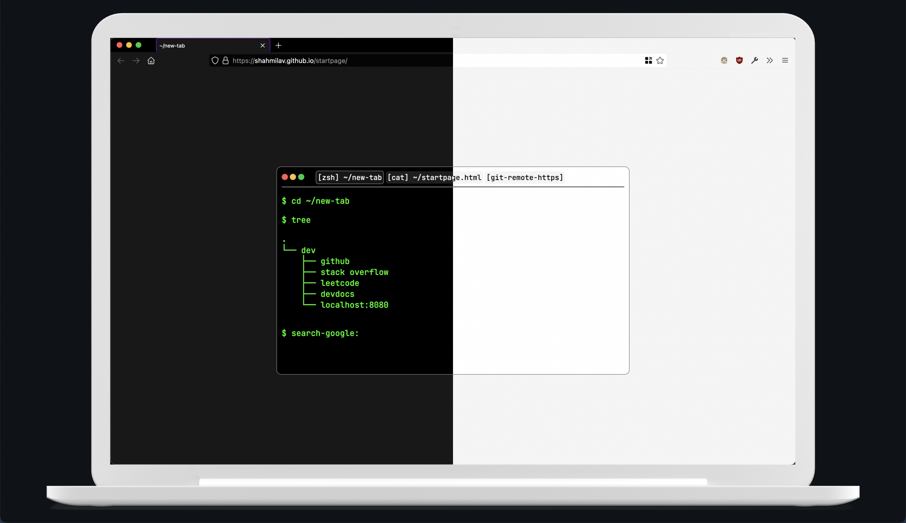

<h1 align="center">Terminal-style Startpage.</h1>

[](https://shahmilav.github.io/startpage/)

View live [here](https://shahmilav.github.io/startpage/).

<hr>

## Table of Contents

* [Features](#features)
* [Installation](#installation)
* [Config](#configure)
* [Easter eggs](#easter-eggs)

<hr>

## Features
* Bookmark and folders organized in a tree structure.
* Search bar (default is Google, can be [changed](#search-engine)

## Installation
No need! To keep the default setup (and unfortunately, the bookmarks) just visit https://shahmilav.github.io/startpage/.
However, in order to be able to configure stuff, clone the git repository: ```git clone https://github.com/shahmilav/startpage terminal-startpage``` and see [the below section.](#configure)

## Configure
After cloning the repo, simply edit HTML and CSS as you normally would. 

### Colorschemes!!
Currently we have one theme, **Nord.** It is the default theme. Change it by changing the index.html style sheet. More themes to come soon!

### Bookmarks
To change the bookmarks, see lines [```32-48```](https://github.com/shahmilav/startpage/blob/d99331ae99ef4c1c14252362a48eceeba0848324/index.html#L32-L48).
### Search Engine
Edit lines [```51-54```](https://github.com/shahmilav/startpage/blob/d99331ae99ef4c1c14252362a48eceeba0848324/index.html#L51-L54). The default is DuckDuckGo.

## Easter Eggs
* The terminal tabs actually work! 
  * ```cat``` will actually show the source code of ```index.html```!
  * ```git-remote-https``` will take you right to this repo.
